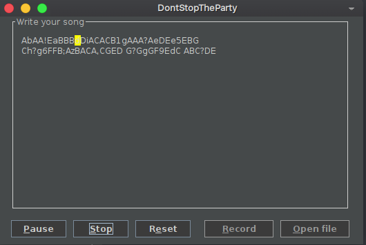

# DontStopTheParty


## Description

This project, created for the INFO1120 course - Programs Construction Thecniques - aims to create and easy an intuitive way of playing music using as entry music notes such as A, B, C, ...

<p align="center">
     <br>
    DontStopTheParty Main UI
</p>

## Usage

Just open the ".jar" release with JRE

In linux bash,

```
java --jar dontstoptheparty-SNAPSHOT-1.0.2-jar-with-dependencies.jar
```

## Authors

- Guilherme Santana
- João Pedro Silveira
- Renan Magagnin
- Wellington M. Espindula.

### Documentation

The general documentation can be found in:
<https://dont-stop-the-party-doc.herokuapp.com>